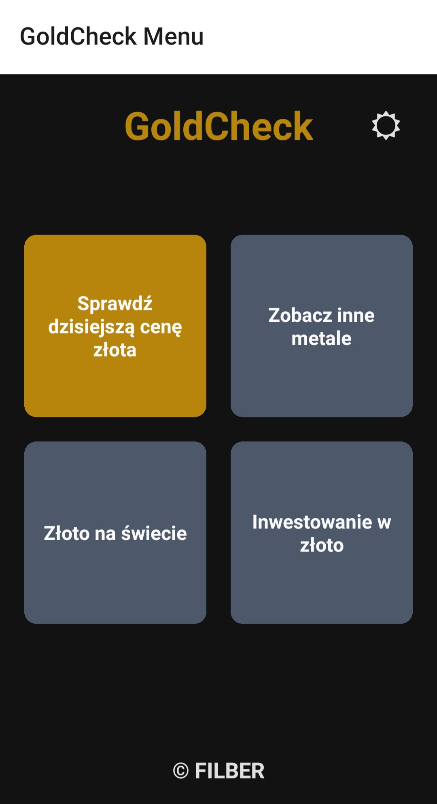
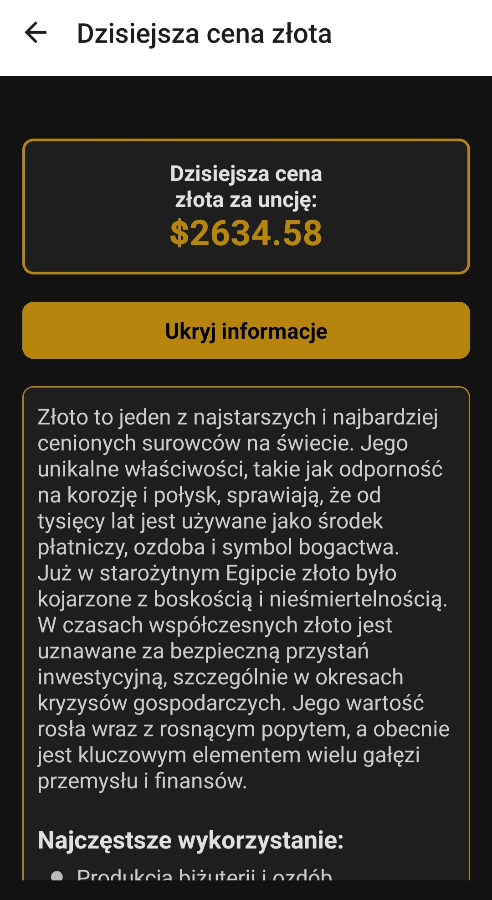
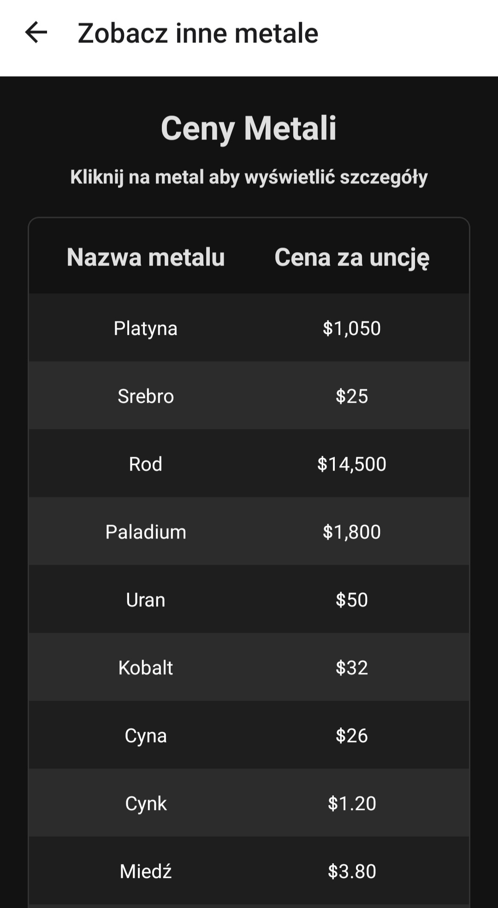
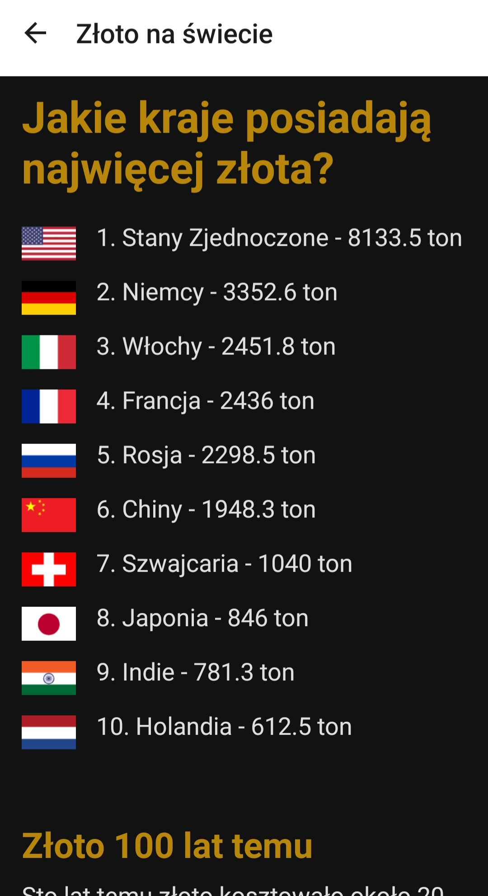

# GameHub

## Screenshots

    </img>
     
    </img>
     
    </img>
     
    </img>

## Description

-   The app fetches and displays the current price of gold in real-time using the MetalPriceAPI.
-   Includes educational content about gold's historical and industrial significance, offering insights for users interested in investments.
-   Designed with React Native, ensuring a responsive and smooth user interface for both iOS and Android platforms.
-   Implements React Context API for efficient state management, improving scalability and maintainability.
-   Features dynamically styled UI elements tailored for both dark and light modes, enhancing readability and aesthetics.

#### Technology used:

-   React Native
-   JavaScript
-   Typescript
-   React Hooks
-   React Native StyleSheet
-   Axios
-   Created Context for metal prices
-   Used API - [MetalpriceAPI](https://metalpriceapi.com/)

## Author info

-   **Name:** Filip Bereszyński
-   **Contact:**
    -   bereszynski.filip@gmail.com
    -   (+48) 510 240 074
